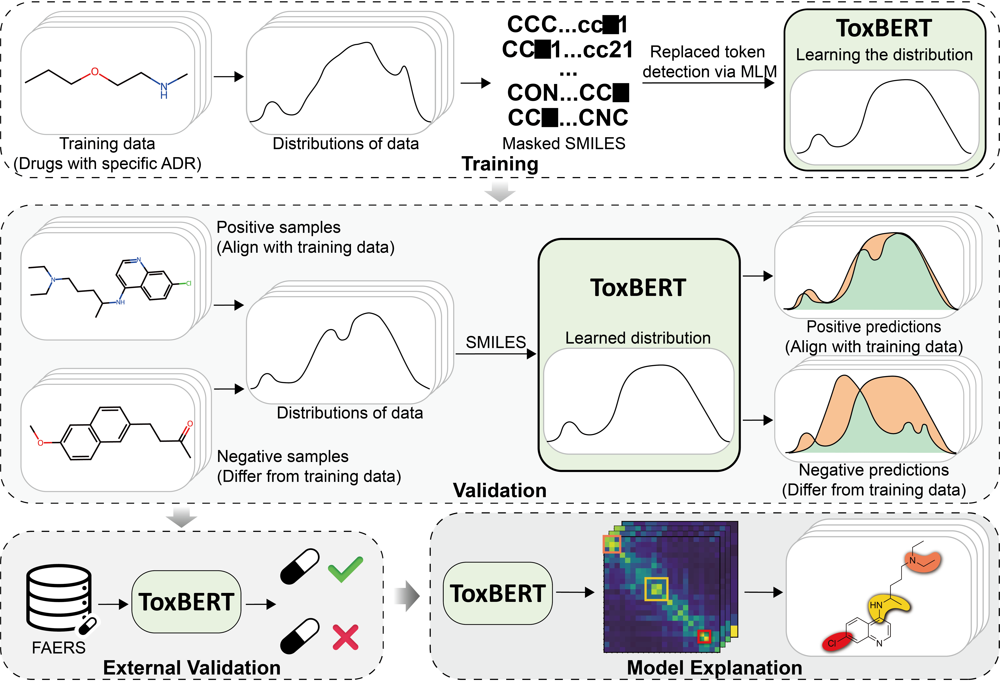

# ToxBERT


Implementation of the Paper ***"ToxBERT"***

## Installation
### Prerequisites
- Python
- PyTorch
- PyTorch Lightning
- Huggingface Transformers and Tokenizers
- RDKit
- Numpy
- Pandas
- Scikit-learn

### Install
You can install the required packages mentioned above or using the following command. 
```bash
git clone https://github.com/FEIFEIEIAr/ToxBERT.git
cd ToxBERT
conda env create -f environment.yaml
conda activate ToxBERT
```
The environment is configured for GPU usage by default. To use the CPU version, remove nvidia* dependencies in environment.yaml and install the CPU version of PyTorch.

Note:
- Package versions are flexible, and the code is not sensitive to specific versions. If issues arise with conda or environment.yaml, try installing prerequisites individually.
- This code is tested only on **Linux**.

## Training
All parameters can be configured in bash files.

An example of DIQTA is provided `docs/DIQTA`.
```bash
bash drugs.sh
```
`bert_vocab_qt.txt` serves as the vocabulary file. Modify or generate a vocabulary file according to your tasks. Vocabulary file is fixed in `train.py`, update it before running the training script for your own task.


## Ablation
Evaluate the impact of different hyperparameters on model performance. 

A DIQTA example is provided in `docs/DIQTA`, including variations for:
- Mask ratio
- Dropout ratio
- Normalization
- Weight decay
- Dimension
- Number of heads
- Number of layers
```bash
bash ablation.sh
```

## Visulazation
Specify checkpoints files before running the following command to visualize the attention map.
```bash
# Specify following parameters in the script
# path = "/path/to/checkpoints/"
# checkpoint = path+"checkpoints/epoch=399-step=2000.ckpt"

python visualization.py
```

## References
